# NeuralResearcher


**🌐 Language / 语言 / 言語 / 언어**
- [English](README.md)
- [简体中文](README_zh-CN.md)
- [繁體中文](README_zh-TW.md)
- [日本語](README_ja.md) (現在)
- [한국어](README_ko.md)

---

LangGraphベースのインテリジェント研究アシスタントで、自動的に深度研究を実行し、高品質な研究レポートを生成します。

## 機能

- 🔍 **スマート検索**: 複数の検索エンジンをサポート（DuckDuckGo、Googleなど）
- 🤖 **8エージェント協調**: LangGraphを使用してオーケストレーター、研究者、編集者、ライター、レビュアー、リバイザー、ヒューマン、パブリッシャーエージェントを調整
- 📊 **並列研究**: 複数のトピックで同時に深度研究を実行
- 📝 **マルチフォーマット出力**: Markdown、PDF、DOCX形式をサポート
- 🔄 **品質管理**: 内蔵のレビューと修正メカニズム
- 💰 **コスト追跡**: API呼び出しコストのリアルタイム追跡
- 🎯 **設定可能**: 柔軟な設定オプションとガイドライン
- 🗄️ **RAGフレームワーク**: 統合されたローカル文書検索とベクトルデータベース
- 📚 **マルチデータタイプ**: 文書、構造化データ、データストリーム処理をサポート
- 🔗 **ハイブリッド検索**: ローカル文書とWeb検索のインテリジェントな組み合わせ

## アーキテクチャ設計

### メインワークフローパイプライン

システムは13ステップのメインワークフローに従い、保守性と拡張性を向上させるモジュラーコンポーネントを備えています：


### コアシステムコンポーネント

#### 🔄 **13ステップメインパイプライン**
1. **オーケストレーター初期化** - システム初期化とタスク調整
2. **初期研究** - RAGモジュールを使用した予備情報収集
3. **計画アウトライン** - 研究構造計画とセクション定義
4. **ヒューマンレビュー計画** - オプションの人間監督とフィードバック
5. **計画修正** - フィードバックに基づく計画改善（条件ループ）
6. **並列研究** - マルチスレッド深度研究実行
7. **研究レビュー** - 品質評価と検証
8. **レポート作成** - テンプレートとローカライゼーションによるコンテンツ生成
9. **ヒューマンレビューレポート** - オプションの最終コンテンツ人間レビュー
10. **レポート修正** - フィードバックに基づくコンテンツ改善（条件ループ）
11. **最終レビュー** - 包括的品質チェック
12. **レポート公開** - マルチフォーマット文書生成
13. **オーケストレーター完了** - タスク完了とクリーンアップ

#### 🤖 **8エージェント協調システム**
- **オーケストレーターエージェント**: 全体的なワークフローを調整し、エージェント間の相互作用を管理
- **研究者エージェント**: 情報収集と深度研究を担当
- **編集者エージェント**: 研究アウトライン計画と並列研究管理を担当
- **ライターエージェント**: 最終レポートの執筆と整理を担当
- **レビュアーエージェント**: 品質レビューとフィードバックを担当
- **リバイザーエージェント**: フィードバックに基づくコンテンツ修正を担当
- **ヒューマンエージェント**: 人間監督とフィードバックを担当
- **パブリッシャーエージェント**: マルチフォーマット文書公開を担当

### モジュラーアーキテクチャコンポーネント

システムは独立して開発・保守できる分離されたモジュール設計を採用：

#### 📚 **RAGモジュール - 文書処理と検索**


**主要機能：**
- マルチフォーマット文書処理（PDF、DOCX、TXT、CSV、JSON、XML）
- スキャン文書のOCRテキスト抽出
- チャンク要約とマージによる長文処理
- セマンティック検索のためのMilvusベクトルデータベース
- ハイブリッド検索戦略（ローカル文書+Web検索）
- 構造化データとデータストリームのサポート

#### ⚡ **並列処理モジュール - マルチタスク研究**


**主要機能：**
- 複数の研究タスクの並行実行
- 各トピックの深度検索とタイムアウト処理
- 結果集約と重複除去
- 品質フィルタリングと関連性ランキング
- エラー処理と再試行メカニズム

#### 🌐 **テンプレートとローカライゼーションモジュール**


**主要機能：**
- YAML/JSONテンプレート設定システム
- 章構造と引用形式のカスタマイゼーション
- 多言語サポート（英語、中国語簡体字/繁体字、日本語、韓国語）
- テンプレート未指定時の自由LLM生成
- コンテンツフォーマットと検証

#### 📄 **マルチフォーマット公開モジュール**


**主要機能：**
- Markdown、PDF、DOCX形式生成
- メタデータ統合とファイル整理
- フォールバック形式によるエラー処理
- 公開サマリーと検証
- 柔軟な出力ディレクトリ管理

## インストールと設定

### 1. 依存関係のインストール
```bash
pip install -r requirements.txt
```

### 2. 環境設定
環境変数テンプレートをコピーして設定：
```bash
cp .env.example .env
```

`.env`ファイルを編集して必要なAPIキーを追加：
```env
OPENAI_API_KEY=your_openai_api_key_here
ANTHROPIC_API_KEY=your_anthropic_api_key_here  # オプション
GOOGLE_API_KEY=your_google_api_key_here        # オプション

# RAG設定（オプション）
MILVUS_HOST=localhost
MILVUS_PORT=19530
EMBEDDING_PROVIDER=openai
RETRIEVER=hybrid  # web, local, hybrid
DOC_PATH=./my-docs
```

### 3. Milvusデータベースの起動（オプション、RAG機能用）
```bash
# DockerでMilvusを起動
wget https://github.com/milvus-io/milvus/releases/download/v2.3.0/milvus-standalone-docker-compose.yml -O docker-compose.yml
docker-compose up -d

# ステータス確認
docker-compose ps
```

### 4. 出力ディレクトリの作成
```bash
mkdir -p outputs logs my-docs
```

## 使用方法

### コマンドライン使用

#### 基本使用
```bash
python main.py "AIのヘルスケア応用の展望は？"
```

#### 高度な使用
```bash
python main.py "気候変動が世界の食料安全保障に与える影響" \
  --format markdown pdf docx \
  --max-sections 5 \
  --model gpt-4o \
  --tone analytical \
  --verbose
```

#### 設定ファイルの使用
```bash
python main.py --config task.json
```

### RAG文書管理

#### ローカル文書のインデックス
```bash
# ディレクトリ全体をインデックス
python rag_cli.py index --source ./my-docs

# 単一ファイルをインデックス
python rag_cli.py index --source ./document.pdf
```

#### ローカル文書の検索
```bash
# 基本検索
python rag_cli.py search --query "機械学習アルゴリズム"

# 高度な検索
python rag_cli.py search --query "人工知能" \
  --top-k 5 \
  --doc-types pdf txt \
  --threshold 0.8
```

#### 文書統計の表示
```bash
python rag_cli.py stats
```

### プログラミングインターフェース使用

#### 基本研究
```python
import asyncio
from main import ResearchRunner

async def run_research():
    runner = ResearchRunner()

    result = await runner.run_research_from_query(
        query="人工知能開発の最新トレンド",
        max_sections=3,
        publish_formats={"markdown": True, "pdf": True}
    )

    runner.print_results_summary(result)

asyncio.run(run_research())
```

#### 高度な設定
```python
from config import TaskConfig
from main import ResearchRunner

async def advanced_research():
    task_config = TaskConfig(
        query="金融分野におけるブロックチェーン技術の応用",
        max_sections=5,
        publish_formats={"markdown": True, "pdf": True, "docx": True},
        follow_guidelines=True,
        guidelines=[
            "学術的な文体を使用",
            "具体的なケーススタディを含める",
            "権威ある情報源を引用"
        ],
        model="gpt-4o",
        tone="analytical"
    )

    runner = ResearchRunner()
    result = await runner.run_research_from_config(task_config)

    return result
```

## 設定オプション

### タスク設定 (task.json)
```json
{
  "query": "研究質問",
  "max_sections": 5,
  "publish_formats": {
    "markdown": true,
    "pdf": true,
    "docx": false
  },
  "model": "gpt-4o",
  "tone": "objective",
  "guidelines": [
    "執筆ガイドライン1",
    "執筆ガイドライン2"
  ],
  "verbose": true
}
```

### 環境変数設定
主要設定項目：
- `LLM_PROVIDER`: LLMプロバイダー (openai/anthropic)
- `SMART_LLM_MODEL`: スマートモデル (gpt-4o)
- `FAST_LLM_MODEL`: 高速モデル (gpt-4o-mini)
- `MAX_SEARCH_RESULTS_PER_QUERY`: 検索クエリあたりの最大結果数
- `OUTPUT_PATH`: 出力ディレクトリパス

RAG関連設定：
- `RETRIEVER`: 検索モード (web/local/hybrid)
- `MILVUS_HOST`: Milvusデータベースホスト
- `MILVUS_PORT`: Milvusデータベースポート
- `EMBEDDING_PROVIDER`: 埋め込みモデルプロバイダー (openai/sentence_transformers/huggingface)
- `EMBEDDING_MODEL`: 埋め込みモデル名
- `CHUNK_SIZE`: 文書チャンクサイズ
- `SIMILARITY_THRESHOLD`: 類似度閾値
- `DOC_PATH`: ローカル文書ディレクトリパス

## 出力形式

### 研究レポート構造
1. **タイトルとメタデータ**
2. **目次**
3. **はじめに**
4. **主要研究セクション**
5. **結論**
6. **参考文献**
7. **レポートメタデータ**

### サポートされる出力形式
- **Markdown** (.md): オンライン読書と追加編集に適している
- **PDF** (.pdf): 印刷と正式配布に適している
- **DOCX** (.docx): Microsoft Word編集に適している

## コスト管理

システムは自動的にAPI呼び出しコストを追跡：
- OpenAI API呼び出しコスト
- モデルとトークン使用量による計算
- レポートに総コストを表示
- コスト予算制御をサポート

## トラブルシューティング

### よくある問題

1. **APIキーエラー**
   - `.env`ファイルのAPIキーが正しいか確認
   - APIキーに十分なクォータがあることを確認

2. **検索結果が空**
   - ネットワーク接続を確認
   - 検索エンジンの切り替えを試す
   - 検索クエリを調整

3. **レポート生成失敗**
   - 出力ディレクトリの権限を確認
   - 十分なディスク容量があることを確認
   - ログファイルで詳細なエラー情報を確認

### ログファイル
- アプリケーションログ：`logs/research.log`
- 詳細なエラー情報とデバッグ情報

## テストと検証

### サンプル実行
```bash

# クイックテスト
python -c "
import asyncio
from main import ResearchRunner
async def test():
    runner = ResearchRunner()
    result = await runner.run_research_from_query('機械学習とは何ですか？', max_sections=2)
    print(f'ステータス: {result[\"status\"]}')
asyncio.run(test())
"
```

### ヒューマンフィードバックテスト
```bash
# ヒューマンフィードバック有効化研究
python main.py "AI開発トレンド" --format markdown --verbose
# 注意：研究プロセス中にヒューマン入力フィードバックが必要
```

## 拡張開発

### 新しいエージェントの追加
1. `agents/`ディレクトリに新しいエージェントクラスを作成
2. ベースエージェントインターフェースを継承
3. `graph.py`に新しいノードを登録
4. ワークフロー図を更新

### 新しいツールの追加
1. `tools/`ディレクトリに新しいツールを作成
2. 必要なインターフェースメソッドを実装
3. 関連エージェントに新しいツールを統合

### カスタム出力形式
1. `tools/document_tools.py`に新しいジェネレーターを追加
2. `PublisherAgent`を更新して新しい形式をサポート
3. 設定に新しい形式オプションを追加

## ライセンス

Apache License 2.0

## 貢献

プロジェクトの改善のためのIssuesとPull Requestsを歓迎します。

## 変更履歴

### v2.0.0 - 8エージェントパイプライン
- 8つの専門エージェントに拡張
- ワークフロー調整のためのオーケストレーターエージェントを追加
- コンテンツ修正のためのリバイザーエージェントを追加
- ヒューマン監督のためのヒューマンエージェントを追加
- 完全なヒューマンフィードバックループ
- 高度な品質管理メカニズム
- 条件付き修正プロセス
- 詳細なパフォーマンス監視

### v1.0.0 - 基本マルチエージェントシステム
- LangGraphベースの完全リファクタリング
- 5エージェント協調アーキテクチャ
- 並列研究処理
- マルチフォーマット出力サポート
- コスト追跡機能
- 基本品質管理メカニズム
