# NeuralResearcher


**🌐 Language / 语言 / 言語 / 언어**
- [English](README.md)
- [简体中文](README_zh-CN.md)
- [繁體中文](README_zh-TW.md)
- [日本語](README_ja.md)
- [한국어](README_ko.md) (현재)

---

LangGraph 기반의 지능형 연구 어시스턴트로, 자동으로 심층 연구를 수행하고 고품질 연구 보고서를 생성합니다.

## 기능

- 🔍 **스마트 검색**: 다양한 검색 엔진 지원 (DuckDuckGo, Google 등)
- 🤖 **8에이전트 협업**: LangGraph를 사용하여 오케스트레이터, 연구원, 편집자, 작성자, 검토자, 수정자, 인간, 발행자 에이전트 조정
- 📊 **병렬 연구**: 여러 주제에 대한 동시 심층 연구
- 📝 **다중 형식 출력**: Markdown, PDF, DOCX 형식 지원
- 🔄 **품질 관리**: 내장된 검토 및 수정 메커니즘
- 💰 **비용 추적**: API 호출 비용의 실시간 추적
- 🎯 **구성 가능**: 유연한 구성 옵션 및 가이드라인
- 🗄️ **RAG 프레임워크**: 통합된 로컬 문서 검색 및 벡터 데이터베이스
- 📚 **다중 데이터 타입**: 문서, 구조화된 데이터, 데이터 스트림 처리 지원
- 🔗 **하이브리드 검색**: 로컬 문서와 웹 검색의 지능적 결합

## 아키텍처 설계

### 메인 워크플로우 파이프라인

시스템은 유지보수성과 확장성을 향상시키는 모듈형 구성 요소를 갖춘 13단계 메인 워크플로우를 따릅니다:


### 핵심 시스템 구성 요소

#### 🔄 **13단계 메인 파이프라인**
1. **오케스트레이터 초기화** - 시스템 초기화 및 작업 조정
2. **초기 연구** - RAG 모듈을 사용한 예비 정보 수집
3. **계획 개요** - 연구 구조 계획 및 섹션 정의
4. **인간 검토 계획** - 선택적 인간 감독 및 피드백
5. **계획 수정** - 피드백 기반 계획 개선 (조건부 루프)
6. **병렬 연구** - 멀티스레드 심층 연구 실행
7. **연구 검토** - 품질 평가 및 검증
8. **보고서 작성** - 템플릿 및 현지화를 통한 콘텐츠 생성
9. **인간 검토 보고서** - 선택적 최종 콘텐츠 인간 검토
10. **보고서 수정** - 피드백 기반 콘텐츠 개선 (조건부 루프)
11. **최종 검토** - 포괄적 품질 검사
12. **보고서 발행** - 다중 형식 문서 생성
13. **오케스트레이터 완료** - 작업 완료 및 정리

#### 🤖 **8에이전트 협업 시스템**
- **오케스트레이터 에이전트**: 전체 워크플로우 조정 및 에이전트 상호작용 관리
- **연구원 에이전트**: 정보 수집 및 심층 연구 담당
- **편집자 에이전트**: 연구 개요 계획 및 병렬 연구 관리 담당
- **작성자 에이전트**: 최종 보고서 작성 및 정리 담당
- **검토자 에이전트**: 품질 검토 및 피드백 담당
- **수정자 에이전트**: 피드백 기반 콘텐츠 수정 담당
- **인간 에이전트**: 인간 감독 및 피드백 담당
- **발행자 에이전트**: 다중 형식 문서 발행 담당

### 모듈형 아키텍처 구성 요소

시스템은 독립적으로 개발 및 유지보수할 수 있는 분리된 모듈 설계를 채택:

#### 📚 **RAG 모듈 - 문서 처리 및 검색**


**주요 기능:**
- 다중 형식 문서 처리 (PDF, DOCX, TXT, CSV, JSON, XML)
- 스캔 문서의 OCR 텍스트 추출
- 청크 요약 및 병합을 통한 긴 텍스트 처리
- 의미 검색을 위한 Milvus 벡터 데이터베이스
- 하이브리드 검색 전략 (로컬 문서 + 웹 검색)
- 구조화된 데이터 및 데이터 스트림 지원

#### ⚡ **병렬 처리 모듈 - 다중 작업 연구**


**주요 기능:**
- 여러 연구 작업의 동시 실행
- 각 주제의 심층 검색 및 타임아웃 처리
- 결과 집계 및 중복 제거
- 품질 필터링 및 관련성 순위
- 오류 처리 및 재시도 메커니즘

#### 🌐 **템플릿 및 현지화 모듈**


**주요 기능:**
- YAML/JSON 템플릿 구성 시스템
- 장 구조 및 인용 형식 사용자 정의
- 다국어 지원 (영어, 중국어 간체/번체, 일본어, 한국어)
- 템플릿 미지정 시 자유 LLM 생성
- 콘텐츠 형식화 및 검증

#### 📄 **다중 형식 발행 모듈**


**주요 기능:**
- Markdown, PDF, DOCX 형식 생성
- 메타데이터 통합 및 파일 정리
- 폴백 형식을 통한 오류 처리
- 발행 요약 및 검증
- 유연한 출력 디렉토리 관리

## 설치 및 구성

### 1. 종속성 설치
```bash
pip install -r requirements.txt
```

### 2. 환경 구성
환경 변수 템플릿을 복사하고 구성:
```bash
cp .env.example .env
```

`.env` 파일을 편집하고 필요한 API 키 추가:
```env
OPENAI_API_KEY=your_openai_api_key_here
ANTHROPIC_API_KEY=your_anthropic_api_key_here  # 선택사항
GOOGLE_API_KEY=your_google_api_key_here        # 선택사항

# RAG 구성 (선택사항)
MILVUS_HOST=localhost
MILVUS_PORT=19530
EMBEDDING_PROVIDER=openai
RETRIEVER=hybrid  # web, local, hybrid
DOC_PATH=./my-docs
```

### 3. Milvus 데이터베이스 시작 (선택사항, RAG 기능용)
```bash
# Docker를 사용하여 Milvus 시작
wget https://github.com/milvus-io/milvus/releases/download/v2.3.0/milvus-standalone-docker-compose.yml -O docker-compose.yml
docker-compose up -d

# 상태 확인
docker-compose ps
```

### 4. 출력 디렉토리 생성
```bash
mkdir -p outputs logs my-docs
```

## 사용법

### 명령줄 사용

#### 기본 사용
```bash
python main.py "AI의 의료 분야 응용 전망은?"
```

#### 고급 사용
```bash
python main.py "기후 변화가 전 세계 식량 안보에 미치는 영향" \
  --format markdown pdf docx \
  --max-sections 5 \
  --model gpt-4o \
  --tone analytical \
  --verbose
```

#### 구성 파일 사용
```bash
python main.py --config task.json
```

### RAG 문서 관리

#### 로컬 문서 인덱싱
```bash
# 전체 디렉토리 인덱싱
python rag_cli.py index --source ./my-docs

# 단일 파일 인덱싱
python rag_cli.py index --source ./document.pdf
```

#### 로컬 문서 검색
```bash
# 기본 검색
python rag_cli.py search --query "머신러닝 알고리즘"

# 고급 검색
python rag_cli.py search --query "인공지능" \
  --top-k 5 \
  --doc-types pdf txt \
  --threshold 0.8
```

#### 문서 통계 보기
```bash
python rag_cli.py stats
```

### 프로그래밍 인터페이스 사용

#### 기본 연구
```python
import asyncio
from main import ResearchRunner

async def run_research():
    runner = ResearchRunner()

    result = await runner.run_research_from_query(
        query="인공지능 개발의 최신 트렌드",
        max_sections=3,
        publish_formats={"markdown": True, "pdf": True}
    )

    runner.print_results_summary(result)

asyncio.run(run_research())
```

#### 고급 구성
```python
from config import TaskConfig
from main import ResearchRunner

async def advanced_research():
    task_config = TaskConfig(
        query="금융 분야에서의 블록체인 기술 응용",
        max_sections=5,
        publish_formats={"markdown": True, "pdf": True, "docx": True},
        follow_guidelines=True,
        guidelines=[
            "학술적 글쓰기 스타일 사용",
            "구체적인 사례 연구 포함",
            "권위 있는 출처 인용"
        ],
        model="gpt-4o",
        tone="analytical"
    )

    runner = ResearchRunner()
    result = await runner.run_research_from_config(task_config)

    return result
```

## 구성 옵션

### 작업 구성 (task.json)
```json
{
  "query": "연구 질문",
  "max_sections": 5,
  "publish_formats": {
    "markdown": true,
    "pdf": true,
    "docx": false
  },
  "model": "gpt-4o",
  "tone": "objective",
  "guidelines": [
    "작성 가이드라인 1",
    "작성 가이드라인 2"
  ],
  "verbose": true
}
```

### 환경 변수 구성
주요 구성 항목:
- `LLM_PROVIDER`: LLM 제공업체 (openai/anthropic)
- `SMART_LLM_MODEL`: 스마트 모델 (gpt-4o)
- `FAST_LLM_MODEL`: 빠른 모델 (gpt-4o-mini)
- `MAX_SEARCH_RESULTS_PER_QUERY`: 검색 쿼리당 최대 결과 수
- `OUTPUT_PATH`: 출력 디렉토리 경로

RAG 관련 구성:
- `RETRIEVER`: 검색 모드 (web/local/hybrid)
- `MILVUS_HOST`: Milvus 데이터베이스 호스트
- `MILVUS_PORT`: Milvus 데이터베이스 포트
- `EMBEDDING_PROVIDER`: 임베딩 모델 제공업체 (openai/sentence_transformers/huggingface)
- `EMBEDDING_MODEL`: 임베딩 모델 이름
- `CHUNK_SIZE`: 문서 청크 크기
- `SIMILARITY_THRESHOLD`: 유사도 임계값
- `DOC_PATH`: 로컬 문서 디렉토리 경로

## 출력 형식

### 연구 보고서 구조
1. **제목 및 메타데이터**
2. **목차**
3. **서론**
4. **주요 연구 섹션**
5. **결론**
6. **참고문헌**
7. **보고서 메타데이터**

### 지원되는 출력 형식
- **Markdown** (.md): 온라인 읽기 및 추가 편집에 적합
- **PDF** (.pdf): 인쇄 및 공식 배포에 적합
- **DOCX** (.docx): Microsoft Word 편집에 적합

## 비용 관리

시스템은 자동으로 API 호출 비용을 추적:
- OpenAI API 호출 비용
- 모델 및 토큰 사용량에 따른 계산
- 보고서에 총 비용 표시
- 비용 예산 제어 지원

## 문제 해결

### 일반적인 문제

1. **API 키 오류**
   - `.env` 파일의 API 키가 올바른지 확인
   - API 키에 충분한 할당량이 있는지 확인

2. **검색 결과가 비어있음**
   - 네트워크 연결 확인
   - 검색 엔진 전환 시도
   - 검색 쿼리 조정

3. **보고서 생성 실패**
   - 출력 디렉토리 권한 확인
   - 충분한 디스크 공간이 있는지 확인
   - 로그 파일에서 자세한 오류 정보 확인

### 로그 파일
- 애플리케이션 로그: `logs/research.log`
- 자세한 오류 정보 및 디버그 정보

## 테스트 및 검증

### 예제 실행
```bash

# 빠른 테스트
python -c "
import asyncio
from main import ResearchRunner
async def test():
    runner = ResearchRunner()
    result = await runner.run_research_from_query('머신러닝이란 무엇인가?', max_sections=2)
    print(f'상태: {result[\"status\"]}')
asyncio.run(test())
"
```

### 인간 피드백 테스트
```bash
# 인간 피드백 활성화 연구
python main.py "AI 개발 트렌드" --format markdown --verbose
# 참고: 연구 과정 중 인간 입력 피드백이 필요합니다
```

## 확장 개발

### 새로운 에이전트 추가
1. `agents/` 디렉토리에 새로운 에이전트 클래스 생성
2. 기본 에이전트 인터페이스 상속
3. `graph.py`에 새로운 노드 등록
4. 워크플로우 다이어그램 업데이트

### 새로운 도구 추가
1. `tools/` 디렉토리에 새로운 도구 생성
2. 필요한 인터페이스 메서드 구현
3. 관련 에이전트에 새로운 도구 통합

### 사용자 정의 출력 형식
1. `tools/document_tools.py`에 새로운 생성기 추가
2. `PublisherAgent`를 업데이트하여 새로운 형식 지원
3. 구성에 새로운 형식 옵션 추가

## 라이선스

Apache License 2.0

## 기여

프로젝트 개선을 위한 Issues 및 Pull Requests를 환영합니다.

## 변경 로그

### v2.0.0 - 8에이전트 파이프라인
- 8개의 전문 에이전트로 확장
- 워크플로우 조정을 위한 오케스트레이터 에이전트 추가
- 콘텐츠 수정을 위한 수정자 에이전트 추가
- 인간 감독을 위한 인간 에이전트 추가
- 완전한 인간 피드백 루프
- 고급 품질 관리 메커니즘
- 조건부 수정 프로세스
- 자세한 성능 모니터링

### v1.0.0 - 기본 다중 에이전트 시스템
- LangGraph 기반 완전 리팩토링
- 5에이전트 협업 아키텍처
- 병렬 연구 처리
- 다중 형식 출력 지원
- 비용 추적 기능
- 기본 품질 관리 메커니즘
