# NeuralResearcher


**🌐 Language / 语言 / 言語 / 언어**
- [English](README.md)
- [简体中文](README_zh-CN.md) (当前)
- [繁體中文](README_zh-TW.md)
- [日本語](README_ja.md)
- [한국어](README_ko.md)

---

基于LangGraph的智能研究助手，能够自动进行深度研究并生成高质量的研究报告。

## 功能特性

- 🔍 **智能搜索**：支持多种搜索引擎（DuckDuckGo、Google等）
- 🤖 **8智能体协作**：使用LangGraph协调编排器、研究员、编辑、写作、审查、修订、人工和发布智能体
- 📊 **并行研究**：同时对多个主题进行深度研究
- 📝 **多格式输出**：支持Markdown、PDF、DOCX格式
- 🔄 **质量控制**：内置审查和修订机制
- 💰 **成本跟踪**：实时跟踪API调用成本
- 🎯 **可配置**：灵活的配置选项和指导原则
- 🗄️ **RAG框架**：集成本地文档检索和向量数据库
- 📚 **多数据类型**：支持文档、结构化数据和数据流处理
- 🔗 **混合检索**：智能结合本地文档和网络搜索

## 架构设计

### 主工作流管道

系统遵循13步主工作流，具有模块化组件以增强可维护性和可扩展性：



### 核心系统组件

#### 🔄 **13步主管道**
1. **编排器初始化** - 系统初始化和任务协调
2. **初始研究** - 使用RAG模块进行初步信息收集
3. **计划大纲** - 研究结构规划和章节定义
4. **人工审查计划** - 可选的人工监督和反馈
5. **修订计划** - 基于反馈的计划完善（条件循环）
6. **并行研究** - 多线程深度研究执行
7. **审查研究** - 质量评估和验证
8. **撰写报告** - 使用模板和本地化进行内容生成
9. **人工审查报告** - 可选的最终内容人工审查
10. **修订报告** - 基于反馈的内容完善（条件循环）
11. **最终审查** - 综合质量检查
12. **发布报告** - 多格式文档生成
13. **编排器完成** - 任务完成和清理

#### 🤖 **8智能体协作系统**
- **编排器智能体**：协调整体工作流程并管理智能体交互
- **研究员智能体**：负责信息收集和深度研究
- **编辑智能体**：负责研究大纲规划和并行研究管理
- **写作智能体**：负责撰写和组织最终报告
- **审查智能体**：负责质量审查和反馈
- **修订智能体**：负责基于反馈修订内容
- **人工智能体**：负责人工监督和反馈
- **发布智能体**：负责多格式文档发布

### 模块化架构组件

系统采用解耦模块设计，可以独立开发和维护：

#### 📚 **RAG模块 - 文档处理与检索**


**主要功能：**
- 多格式文档处理（PDF、DOCX、TXT、CSV、JSON、XML）
- 扫描文档的OCR文本提取
- 分块摘要和合并的长文本处理
- Milvus向量数据库进行语义搜索
- 混合检索策略（本地文档+网络搜索）
- 支持结构化数据和数据流

#### ⚡ **并行处理模块 - 多任务研究**


**主要功能：**
- 多个研究任务的并发执行
- 每个主题的深度搜索和超时处理
- 结果聚合和去重
- 质量过滤和相关性排序
- 错误处理和重试机制

#### 🌐 **模板与本地化模块**


**主要功能：**
- YAML/JSON模板配置系统
- 章节结构和引用格式自定义
- 多语言支持（英语、简体中文/繁体中文、日语、韩语）
- 未指定模板时的自由LLM生成
- 内容格式化和验证

#### 📄 **多格式发布模块**


**主要功能：**
- Markdown、PDF和DOCX格式生成
- 元数据集成和文件组织
- 带回退格式的错误处理
- 发布摘要和验证
- 灵活的输出目录管理

## 安装和配置

### 1. 安装依赖
```bash
pip install -r requirements.txt
```

### 2. 环境配置
复制环境变量模板并配置：
```bash
cp .env.example .env
```

编辑`.env`文件并添加必要的API密钥：
```env
OPENAI_API_KEY=your_openai_api_key_here
ANTHROPIC_API_KEY=your_anthropic_api_key_here  # 可选
GOOGLE_API_KEY=your_google_api_key_here        # 可选

# RAG配置（可选）
MILVUS_HOST=localhost
MILVUS_PORT=19530
EMBEDDING_PROVIDER=openai
RETRIEVER=hybrid  # web, local, hybrid
DOC_PATH=./my-docs
```

### 3. 启动Milvus数据库（可选，用于RAG功能）
```bash
# 使用Docker启动Milvus
wget https://github.com/milvus-io/milvus/releases/download/v2.3.0/milvus-standalone-docker-compose.yml -O docker-compose.yml
docker-compose up -d

# 检查状态
docker-compose ps
```

### 4. 创建输出目录
```bash
mkdir -p outputs logs my-docs
```

## 使用方法

### 命令行使用

#### 基本使用
```bash
python main.py "AI在医疗保健中的应用前景如何？"
```

#### 高级使用
```bash
python main.py "气候变化对全球粮食安全的影响" \
  --format markdown pdf docx \
  --max-sections 5 \
  --model gpt-4o \
  --tone analytical \
  --verbose
```

#### 使用配置文件
```bash
python main.py --config task.json
```

### RAG文档管理

#### 索引本地文档
```bash
# 索引整个目录
python rag_cli.py index --source ./my-docs

# 索引单个文件
python rag_cli.py index --source ./document.pdf
```

#### 搜索本地文档
```bash
# 基本搜索
python rag_cli.py search --query "机器学习算法"

# 高级搜索
python rag_cli.py search --query "人工智能" \
  --top-k 5 \
  --doc-types pdf txt \
  --threshold 0.8
```

#### 查看文档统计
```bash
python rag_cli.py stats
```

### 编程接口使用

#### 基本研究
```python
import asyncio
from main import ResearchRunner

async def run_research():
    runner = ResearchRunner()

    result = await runner.run_research_from_query(
        query="人工智能发展的最新趋势",
        max_sections=3,
        publish_formats={"markdown": True, "pdf": True}
    )

    runner.print_results_summary(result)

asyncio.run(run_research())
```

#### 高级配置
```python
from config import TaskConfig
from main import ResearchRunner

async def advanced_research():
    task_config = TaskConfig(
        query="区块链技术在金融领域的应用",
        max_sections=5,
        publish_formats={"markdown": True, "pdf": True, "docx": True},
        follow_guidelines=True,
        guidelines=[
            "使用学术写作风格",
            "包含具体案例研究",
            "引用权威来源"
        ],
        model="gpt-4o",
        tone="analytical"
    )

    runner = ResearchRunner()
    result = await runner.run_research_from_config(task_config)

    return result
```

## 配置选项

### 任务配置 (task.json)
```json
{
  "query": "研究问题",
  "max_sections": 5,
  "publish_formats": {
    "markdown": true,
    "pdf": true,
    "docx": false
  },
  "model": "gpt-4o",
  "tone": "objective",
  "guidelines": [
    "写作指导原则1",
    "写作指导原则2"
  ],
  "verbose": true
}
```

### 环境变量配置
主要配置项：
- `LLM_PROVIDER`: LLM提供商 (openai/anthropic)
- `SMART_LLM_MODEL`: 智能模型 (gpt-4o)
- `FAST_LLM_MODEL`: 快速模型 (gpt-4o-mini)
- `MAX_SEARCH_RESULTS_PER_QUERY`: 每次搜索查询的最大结果数
- `OUTPUT_PATH`: 输出目录路径

RAG相关配置：
- `RETRIEVER`: 检索模式 (web/local/hybrid)
- `MILVUS_HOST`: Milvus数据库主机
- `MILVUS_PORT`: Milvus数据库端口
- `EMBEDDING_PROVIDER`: 嵌入模型提供商 (openai/sentence_transformers/huggingface)
- `EMBEDDING_MODEL`: 嵌入模型名称
- `CHUNK_SIZE`: 文档块大小
- `SIMILARITY_THRESHOLD`: 相似度阈值
- `DOC_PATH`: 本地文档目录路径

## 输出格式

### 研究报告结构
1. **标题和元数据**
2. **目录**
3. **引言**
4. **主要研究章节**
5. **结论**
6. **参考文献**
7. **报告元数据**

### 支持的输出格式
- **Markdown** (.md): 适合在线阅读和进一步编辑
- **PDF** (.pdf): 适合打印和正式分发
- **DOCX** (.docx): 适合Microsoft Word编辑

## 成本管理

系统自动跟踪API调用成本：
- OpenAI API调用成本
- 按模型和令牌使用量计算
- 报告中显示总成本
- 支持成本预算控制

## 故障排除

### 常见问题

1. **API密钥错误**
   - 检查`.env`文件中的API密钥是否正确
   - 确认API密钥有足够的配额

2. **搜索结果为空**
   - 检查网络连接
   - 尝试切换搜索引擎
   - 调整搜索查询

3. **报告生成失败**
   - 检查输出目录权限
   - 确认有足够的磁盘空间
   - 查看日志文件获取详细错误信息

### 日志文件
- 应用程序日志：`logs/research.log`
- 详细错误信息和调试信息

## 测试和验证

### 示例运行
```bash

# 快速测试
python -c "
import asyncio
from main import ResearchRunner
async def test():
    runner = ResearchRunner()
    result = await runner.run_research_from_query('什么是机器学习？', max_sections=2)
    print(f'状态: {result[\"status\"]}')
asyncio.run(test())
"
```

### 人工反馈测试
```bash
# 启用人工反馈的研究
python main.py "AI发展趋势" --format markdown --verbose
# 注意：这将在研究过程中需要人工输入反馈
```

## 扩展开发

### 添加新智能体
1. 在`agents/`目录中创建新的智能体类
2. 继承基础智能体接口
3. 在`graph.py`中注册新节点
4. 更新工作流程图

### 添加新工具
1. 在`tools/`目录中创建新工具
2. 实现必要的接口方法
3. 在相关智能体中集成新工具

### 自定义输出格式
1. 在`tools/document_tools.py`中添加新生成器
2. 更新`PublisherAgent`以支持新格式
3. 在配置中添加新格式选项

## 许可证

Apache License 2.0

## 贡献

欢迎提交Issues和Pull Requests来改进项目。

## 更新日志

### v2.0.0 - 8智能体管道
- 扩展到8个专业智能体
- 添加编排器智能体进行工作流协调
- 添加修订智能体进行内容修订
- 添加人工智能体进行人工监督
- 完整的人工反馈循环
- 高级质量控制机制
- 条件修订过程
- 详细的性能监控

### v1.0.0 - 基础多智能体系统
- 基于LangGraph的完整重构
- 5智能体协作架构
- 并行研究处理
- 多格式输出支持
- 成本跟踪功能
- 基础质量控制机制
